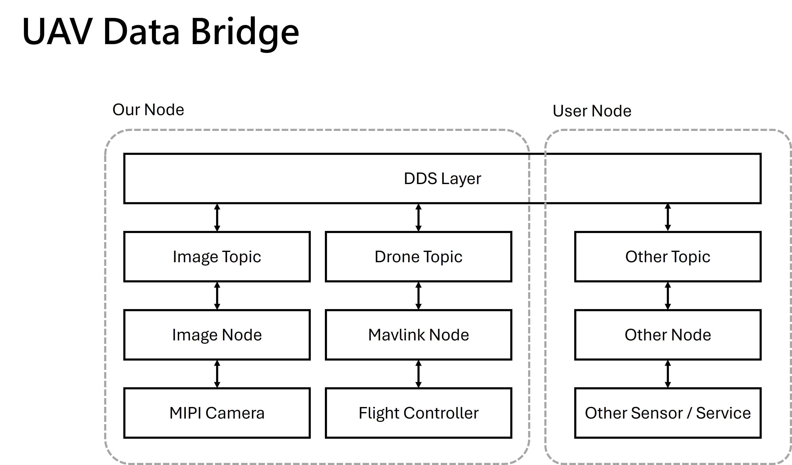

# UAV Data Bridge for Stronge Neo Jetson

# How to use?

## Clone
```bash
git clone https://github.com/strongco223/SNJ-UAV-Data-Bridge-for-Stronge-Neo-Jetson.git

cd SNJ-UAV-Data-Bridge-for-Stronge-Neo-Jetson
```
## Build
```bash
docker compose build --no-cache
```

## Container
```bash
docker compose up -d
```

## Stop
```bash
docker compose up down
```

## Enter Contrainer
```bash
docker exec -it mavros bash
```

```bash
docker exec -it ros-camera bash
```


# Structure



# Usage Topic
## Command
```
ros2 topic list
ros2 topic echo /topic_name
ros2 topic echo /camera/image_raw
```

## Topic
```bash
/mavros/local_position/pose
```
* position coordinate: (x, y, z) == (East, North, Up)
* orientation corrdinate: (x, y, z, w) == (about East, about North, about Up, about Scale)


### Pose (after EKF)

```bash
header:
  stamp:
    sec: 1775703616
    nanosec: 872007668
  frame_id: map
pose:
  position:
    x: -0.03146734461188316
    y: 0.029793402180075645
    z: 10.121991157531738
  orientation:
    x: -0.0015780781070130292
    y: -0.020378659799525186
    z: -0.9991300719324641
    w: 0.03635199401543415
```
### IMU (raw)

```bash
header:
  stamp:
    sec: 1775705443
    nanosec: 45226174
  frame_id: base_link
orientation:
  x: 0.0012748111170975056
  y: -0.020365027269665447
  z: -0.988670277803273
  w: 0.14871039237680783
orientation_covariance:
- 1.0
- 0.0
- 0.0
- 0.0
- 1.0
- 0.0
- 0.0
- 0.0
- 1.0
angular_velocity:
  x: 0.0005428672884590924
  y: -0.0003062807954847815
  z: -0.0019554486498236656
angular_velocity_covariance:
- 1.2184696791468346e-07
- 0.0
- 0.0
- 0.0
- 1.2184696791468346e-07
- 0.0
- 0.0
- 0.0
- 1.2184696791468346e-07
linear_acceleration:
  x: 0.022524535655975342
  y: 0.3887545168399823
  z: 9.810283660888672
linear_acceleration_covariance:
- 8.999999999999999e-08
- 0.0
- 0.0
- 0.0
- 8.999999999999999e-08
- 0.0
- 0.0
- 0.0
- 8.999999999999999e-08
```

# Reference 

* [MAVROS](https://docs.ros.org/en/kilted/Tutorials/Intermediate/Tf2/Quaternion-Fundamentals.html)

# All Topic Table
```
/camera_info
/diagnostics
/image_raw
/mavros/actuator_control
/mavros/adsb/send
/mavros/adsb/vehicle
/mavros/altitude
/mavros/cam_imu_sync/cam_imu_stamp
/mavros/camera/image_captured
/mavros/cellular_status/status
/mavros/companion_process/status
/mavros/debug_value/debug
/mavros/debug_value/debug_float_array
/mavros/debug_value/debug_vector
/mavros/debug_value/named_value_float
/mavros/debug_value/named_value_int
/mavros/debug_value/send
/mavros/esc_status/info
/mavros/esc_status/status
/mavros/esc_telemetry/telemetry
/mavros/fake_gps/mocap/tf
/mavros/geofence/fences
/mavros/gimbal_control/device/attitude_status
/mavros/gimbal_control/device/info
/mavros/gimbal_control/device/set_attitude
/mavros/gimbal_control/manager/info
/mavros/gimbal_control/manager/set_attitude
/mavros/gimbal_control/manager/set_manual_control
/mavros/gimbal_control/manager/set_pitchyaw
/mavros/gimbal_control/manager/status
/mavros/global_position/compass_hdg
/mavros/global_position/global
/mavros/global_position/gp_lp_offset
/mavros/global_position/gp_origin
/mavros/global_position/local
/mavros/global_position/raw/fix
/mavros/global_position/raw/gps_vel
/mavros/global_position/raw/satellites
/mavros/global_position/rel_alt
/mavros/global_position/set_gp_origin
/mavros/gps_input/gps_input
/mavros/gps_rtk/rtk_baseline
/mavros/gps_rtk/send_rtcm
/mavros/gpsstatus/gps1/raw
/mavros/gpsstatus/gps1/rtk
/mavros/gpsstatus/gps2/raw
/mavros/gpsstatus/gps2/rtk
/mavros/hil/actuator_controls
/mavros/hil/controls
/mavros/hil/gps
/mavros/hil/imu_ned
/mavros/hil/optical_flow
/mavros/hil/rc_inputs
/mavros/hil/state
/mavros/home_position/home
/mavros/home_position/set
/mavros/imu/data
/mavros/imu/data_raw
/mavros/imu/diff_pressure
/mavros/imu/mag
/mavros/imu/static_pressure
/mavros/imu/temperature_baro
/mavros/imu/temperature_imu
/mavros/landing_target/lt_marker
/mavros/landing_target/pose
/mavros/landing_target/pose_in
/mavros/local_position/accel
/mavros/local_position/odom
/mavros/local_position/pose
/mavros/local_position/pose_cov
/mavros/local_position/velocity_body
/mavros/local_position/velocity_body_cov
/mavros/local_position/velocity_local
/mavros/log_transfer/raw/log_data
/mavros/log_transfer/raw/log_entry
/mavros/mag_calibration/report
/mavros/mag_calibration/status
/mavros/manual_control/control
/mavros/manual_control/send
/mavros/mocap/pose
/mavros/mocap/tf
/mavros/mount_control/command
/mavros/mount_control/orientation
/mavros/mount_control/status
/mavros/nav_controller_output/output
/mavros/obstacle/send
/mavros/obstacle_distance_3d/send
/mavros/odometry/in
/mavros/odometry/out
/mavros/onboard_computer/status
/mavros/open_drone_id/basic_id
/mavros/open_drone_id/operator_id
/mavros/open_drone_id/self_id
/mavros/open_drone_id/system
/mavros/open_drone_id/system_update
/mavros/optical_flow/ground_distance
/mavros/optical_flow/raw/optical_flow
/mavros/optical_flow/raw/send
/mavros/param/event
/mavros/play_tune
/mavros/px4flow/ground_distance
/mavros/px4flow/raw/optical_flow_rad
/mavros/px4flow/raw/send
/mavros/px4flow/temperature
/mavros/rallypoint/rallypoints
/mavros/rangefinder/rangefinder
/mavros/rc/in
/mavros/rc/out
/mavros/rc/override
/mavros/setpoint_accel/accel
/mavros/setpoint_attitude/cmd_vel
/mavros/setpoint_attitude/thrust
/mavros/setpoint_position/global
/mavros/setpoint_position/global_to_local
/mavros/setpoint_position/local
/mavros/setpoint_raw/attitude
/mavros/setpoint_raw/global
/mavros/setpoint_raw/local
/mavros/setpoint_raw/target_attitude
/mavros/setpoint_raw/target_global
/mavros/setpoint_raw/target_local
/mavros/setpoint_trajectory/local
/mavros/setpoint_velocity/cmd_vel
/mavros/setpoint_velocity/cmd_vel_unstamped
/mavros/statustext/send
/mavros/target_actuator_control
/mavros/trajectory/generated
/mavros/trajectory/path
/mavros/tunnel/in
/mavros/vision_pose/pose
/mavros/vision_pose/pose_cov
/mavros/vision_speed/speed_twist
/mavros/vision_speed/speed_twist_cov
/mavros/vision_speed/speed_vector
/move_base_simple/goal
/parameter_events
/rosout
/tf
/tf_static
/uas1/mavlink_sink
/uas1/mavlink_source
```